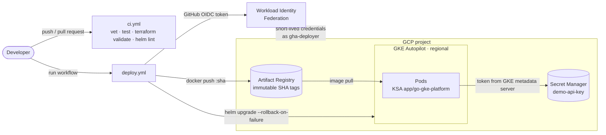

# go-gke-platform

English | [繁體中文](README.zh-TW.md)

[](https://github.com/yamiew00/go-gke-platform/actions/workflows/ci.yml)

A small Go service and everything needed to ship it to **GKE Autopilot**. Terraform defines the
infrastructure, Helm packages the workload, and GitHub Actions deploys it without a single
service-account key.

The service is intentionally tiny; the delivery path around it is the point:

| Area | What this repo shows |
|---|---|
| Infrastructure as Code | Terraform with remote state in GCS: VPC-native Autopilot cluster, Artifact Registry, Secret Manager, IAM, and GitHub OIDC federation |
| Keyless CI/CD | GitHub Actions authenticates through Workload Identity Federation, restricted to this repo's `main` branch |
| Release engineering | Immutable commit-SHA image tags, manual promotion, automatic rollback on failed rollouts, `helm test` smoke check |
| Kubernetes | Liveness/readiness probes, graceful shutdown, HPA, PodDisruptionBudget, zone spreading, hardened security context |
| Secrets | The pod reads Secret Manager through Workload Identity for GKE; the secret never appears in Terraform state, the repo, or CI |

## Architecture



## Security model

Three identities, each with only what it needs:

| Identity | Can | Cannot |
|---|---|---|
| **GitHub Actions** (via `gha-deployer`) | Push images to one repository; deploy to the cluster | Read any secret. It is only reachable from `main` of this repository. |
| **The app** (Kubernetes SA `app/go-gke-platform`) | Read the single secret `demo-api-key` | Anything else in the project |
| **An operator** running Terraform | Change infrastructure | — (authenticates with their own short-lived gcloud token) |

No JSON key is created anywhere. The demo secret is generated by an *ephemeral* `random_password`
and written through the *write-only* `secret_data_wo` argument, so Terraform state only records that
version 1 exists.

## Repository layout

```
app/                     Go service (standard library only) + Dockerfile (distroless, non-root)
infra/bootstrap/         One-time stack: the GCS bucket that holds Terraform state
infra/platform/          VPC, GKE Autopilot, Artifact Registry, Secret Manager, IAM, GitHub OIDC
deploy/helm/             Helm chart: Deployment, Service, HPA, PDB, ServiceAccount, smoke test
.github/workflows/       ci.yml (every push and PR), deploy.yml (manual)
scripts/                 PowerShell helpers that keep a separate gcloud account and kubeconfig
```

## Run it yourself

Prerequisites: a GCP project with billing, `gcloud`, Terraform ≥ 1.11, Helm ≥ 3, and `kubectl`.
Change `project_id` in both `terraform.tfvars` files, the bucket in `infra/platform/backend.hcl`,
and `github_repository` if you fork.

```powershell
# 1. State bucket (local state, run once)
./scripts/tf.ps1 bootstrap init
./scripts/tf.ps1 bootstrap apply

# 2. Platform (about 10 minutes, mostly the cluster)
./scripts/tf.ps1 platform init        # adds -backend-config=backend.hcl
./scripts/tf.ps1 platform plan -out=platform.tfplan
./scripts/tf.ps1 platform apply platform.tfplan

# 3. Hand the outputs to GitHub Actions as repository variables
./scripts/tf.ps1 platform output -json github_actions_variables
#    then: gh variable set <NAME> --body <value>   (for each key)
```

Then run the **deploy** workflow from the Actions tab. It builds the image once per commit, deploys it
with `helm upgrade --wait --rollback-on-failure`, and fails the run unless `helm test` passes.

```powershell
. ./scripts/use-cluster.ps1                  # kubectl for this shell only
kubectl -n app port-forward svc/go-gke-platform 8080:80
curl http://localhost:8080/                  # version, pod name, and whether the secret loaded
```

`scripts/tf.ps1` runs Terraform with a token from the `personal` gcloud configuration
(`GOOGLE_OAUTH_ACCESS_TOKEN`), so a machine that also holds work credentials never mixes the two.
On macOS or Linux, call `terraform -chdir=infra/<stack> ...` directly.

## Operating it

| Task | How |
|---|---|
| Deploy | Run the **deploy** workflow (defaults to the head of `main`) |
| Roll back | Run it again with an older commit SHA: the image already exists and is reused as-is |
| Rotate the secret | Bump `secret_data_wo_version` in `infra/platform/secrets.tf`, apply, then restart the pods |
| Inspect | `kubectl -n app get pods,hpa,pdb` · Logs Explorer shows the JSON logs with proper severities |

## Verified behaviour

Measured on the live cluster with an in-cluster client calling the Service every 100–200 ms:

| Scenario | Result |
|---|---|
| `kubectl rollout restart` of both replicas | **0 failed out of 1,269 requests**: readiness turns 503 first, the pod keeps serving for 5 s, then drains |
| Deploying a commit whose pods can never start | Helm marked revision 2 failed and rolled back to revision 1 on its own; **0 failed out of 3,502 requests**, because `maxUnavailable: 0` keeps the old pods until new ones are ready |
| Pod reading `demo-api-key` | Loaded through the GKE metadata server; the secret's IAM policy lists only `ns/app/sa/go-gke-platform` |

## Problems hit on the first real deploy

| Symptom | Cause | Fix |
|---|---|---|
| `Identity Pool does not exist (go-gke-platform.svc.id.goog)` | GKE creates that pool with the first cluster, but the IAM principal string does not reference the cluster, so Terraform ran both in parallel | Explicit `depends_on` on the cluster |
| `invalid tag "...go-gke-platform\r:<sha>"` | Repository variables were set from Windows output with CRLF line endings | Strip `\r` before `gh variable set` |
| `container has runAsNonRoot and image has non-numeric user (nonroot)` | The kubelet cannot prove a user *name* is not root | `USER 65532:65532` in the Dockerfile |

## Cost and teardown

The GKE free tier covers the management fee of one Autopilot cluster per billing account; Autopilot
then bills the pods' requests (two pods × 0.25 vCPU / 256 MiB here). The Service is `ClusterIP`, so no
load balancer is billed unless you switch it to `LoadBalancer`.

```powershell
./scripts/tf.ps1 platform destroy            # removes everything that costs money
gcloud projects delete go-gke-platform       # or remove the whole project, state bucket included
```

## What I would change for production

- **Split repositories.** Infrastructure and application change at different speeds and need different
  permissions; they share one repo here only to keep the demo readable.
- **GitOps.** Let Argo CD or Flux reconcile the cluster from git instead of CI pushing with `helm upgrade`.
- **Private cluster.** Private nodes with Cloud NAT, and a restricted control-plane endpoint.
- **Supply chain.** Sign images and enforce signatures with Binary Authorization; scan images in CI.
- **Environments.** Separate dev/staging/prod projects, each with its own state prefix and approval gate
  on the GitHub `production` environment.
- **Observability.** SLOs on Managed Service for Prometheus, alerting on error rate and latency.

## License

MIT
