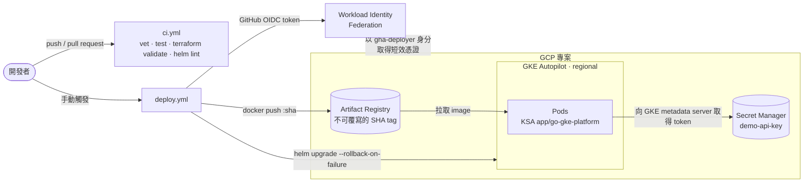

# go-gke-platform

[English](README.md) | 繁體中文

[](https://github.com/yamiew00/go-gke-platform/actions/workflows/ci.yml)

一個小型 Go 服務，以及把它交付到 **GKE Autopilot** 所需的一切：Terraform 定義基礎設施、
Helm 封裝工作負載、GitHub Actions 負責部署，全程不使用任何 service account 金鑰。

服務本身刻意寫得很小，重點是它周圍的交付流程：

| 面向 | 這個 repo 展示了什麼 |
|---|---|
| 基礎設施即程式碼（IaC） | Terraform 搭配存在 GCS 的遠端 state：VPC-native 的 Autopilot 叢集、Artifact Registry、Secret Manager、IAM，以及 GitHub OIDC 聯合身分 |
| 免金鑰 CI/CD | GitHub Actions 透過 Workload Identity Federation 驗證身分，而且只限這個 repo 的 `main` 分支 |
| 發布工程 | image tag 固定為 commit SHA 且不可覆寫、人工觸發部署、rollout 失敗自動回滾、`helm test` 冒煙測試 |
| Kubernetes | liveness / readiness probe、優雅關機、HPA、PodDisruptionBudget、跨 zone 分散、強化的 security context |
| Secrets | Pod 透過 GKE 的 Workload Identity 讀取 Secret Manager；secret 不會出現在 Terraform state、repo 或 CI 裡 |

## 架構



## 安全模型

三種身分，各自只拿到需要的權限：

| 身分 | 可以 | 不可以 |
|---|---|---|
| **GitHub Actions**（透過 `gha-deployer`） | 推 image 到指定的 repository、部署到叢集 | 讀取任何 secret；而且只有這個 repo 的 `main` 分支能取得這個身分 |
| **應用程式**（Kubernetes SA `app/go-gke-platform`） | 讀取唯一一個 secret `demo-api-key` | 專案裡的其他任何東西 |
| **執行 Terraform 的操作者** | 變更基礎設施 | —（用自己的短效 gcloud token 驗證） |

整個流程沒有建立任何 JSON 金鑰。示範用的 secret 由 *ephemeral* 的 `random_password` 產生，
再透過 *write-only* 的 `secret_data_wo` 參數寫入，所以 Terraform state 只記錄「第 1 版已寫入」，
不會有 secret 的值。

## 目錄結構

```
app/                     Go 服務（只用標準函式庫）+ Dockerfile（distroless、非 root）
infra/bootstrap/         一次性的 stack：存放 Terraform state 的 GCS bucket
infra/platform/          VPC、GKE Autopilot、Artifact Registry、Secret Manager、IAM、GitHub OIDC
deploy/helm/             Helm chart：Deployment、Service、HPA、PDB、ServiceAccount、冒煙測試
.github/workflows/       ci.yml（每次 push 和 PR）、deploy.yml（人工觸發）
scripts/                 PowerShell 輔助腳本，讓 gcloud 帳號和 kubeconfig 與本機其他設定隔離
```

## 自己跑一次

前置需求：一個已綁定帳單的 GCP 專案、`gcloud`、Terraform ≥ 1.11、Helm ≥ 3、`kubectl`。
如果你 fork 這個 repo，請修改兩個 `terraform.tfvars` 裡的 `project_id`、
`infra/platform/backend.hcl` 裡的 bucket，以及 `github_repository`。

```powershell
# 1. 建立 state bucket（本機 state，只需跑一次）
./scripts/tf.ps1 bootstrap init
./scripts/tf.ps1 bootstrap apply

# 2. 建立平台（約 10 分鐘，大部分時間在建叢集）
./scripts/tf.ps1 platform init        # 會自動帶入 -backend-config=backend.hcl
./scripts/tf.ps1 platform plan -out=platform.tfplan
./scripts/tf.ps1 platform apply platform.tfplan

# 3. 把輸出值設成 GitHub Actions 的 repository variables
./scripts/tf.ps1 platform output -json github_actions_variables
#    接著對每個 key 執行：gh variable set <NAME> --body <value>
```

接著到 Actions 分頁執行 **deploy** workflow。它對每個 commit 只 build 一次 image，
用 `helm upgrade --wait --rollback-on-failure` 部署，並且要 `helm test` 通過才算成功。

```powershell
. ./scripts/use-cluster.ps1                  # 只在目前這個 shell 設定 kubectl
kubectl -n app port-forward svc/go-gke-platform 8080:80
curl http://localhost:8080/                  # 回傳版本、Pod 名稱，以及 secret 是否讀取成功
```

`scripts/tf.ps1` 會用 `personal` 這組 gcloud 設定的短效 token（`GOOGLE_OAUTH_ACCESS_TOKEN`）
執行 Terraform，所以就算同一台電腦也登入了公司帳號，兩邊也不會混用。
macOS 或 Linux 可以直接執行 `terraform -chdir=infra/<stack> ...`。

## 日常操作

| 工作 | 做法 |
|---|---|
| 部署 | 執行 **deploy** workflow（預設部署 `main` 的最新 commit） |
| 回滾 | 用較舊的 commit SHA 再執行一次；該版 image 已存在，會直接沿用 |
| 輪替 secret | 調高 `infra/platform/secrets.tf` 的 `secret_data_wo_version`，apply 後重啟 Pod |
| 檢查狀態 | `kubectl -n app get pods,hpa,pdb`；Logs Explorer 會以正確的 severity 顯示 JSON log |

## 成本與清除資源

GKE 免費額度會抵掉每個帳單帳戶一個 Autopilot 叢集的管理費；之後 Autopilot 依 Pod 的資源請求計費
（這裡是 2 個 Pod × 0.25 vCPU / 256 MiB）。Service 預設是 `ClusterIP`，除非改成 `LoadBalancer`，
否則不會產生負載平衡器的費用。

```powershell
./scripts/tf.ps1 platform destroy            # 刪除所有會產生費用的資源
gcloud projects delete go-gke-platform       # 或直接刪除整個專案，連同 state bucket
```

## 如果是正式環境，我會怎麼改

- **拆分 repository**：基礎設施和應用程式的變更頻率不同，需要的權限也不同；這裡放在一起只是為了方便閱讀。
- **GitOps**：改由 Argo CD 或 Flux 依照 git 內容同步叢集，而不是由 CI 執行 `helm upgrade` 推送。
- **私有叢集**：節點使用私有 IP 並搭配 Cloud NAT，同時限制 control plane 的存取來源。
- **供應鏈安全**：對 image 簽章，並用 Binary Authorization 強制驗證；在 CI 裡掃描 image 弱點。
- **多環境**：dev、staging、prod 各用獨立專案與獨立的 state prefix，並在 GitHub 的 `production`
  environment 加上核准關卡。
- **可觀測性**：以 Managed Service for Prometheus 定義 SLO，針對錯誤率與延遲設定告警。

## 授權

MIT
